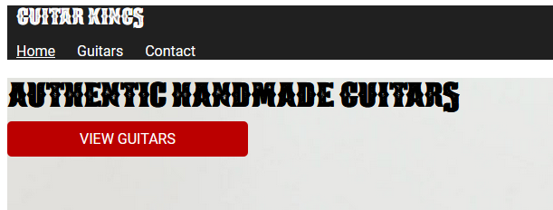

# HTML and CSS Module 2

## Task 4

In this task we will be looking at adding padding and other styling to specific elements.

- Make the call-to-action links (including 'View' and 'On sale') look like they do on the prototype.
- Add spacing around the navigation items in the main navigation.

By the end of the task, your home page should look like this

